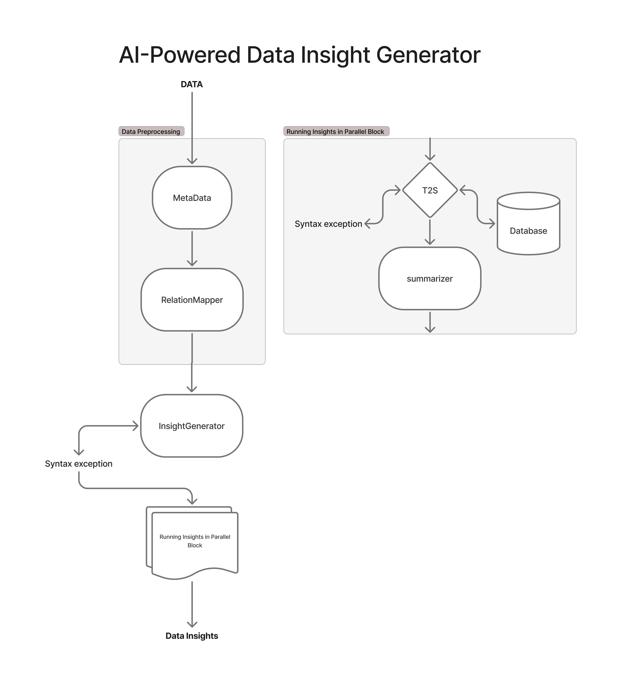
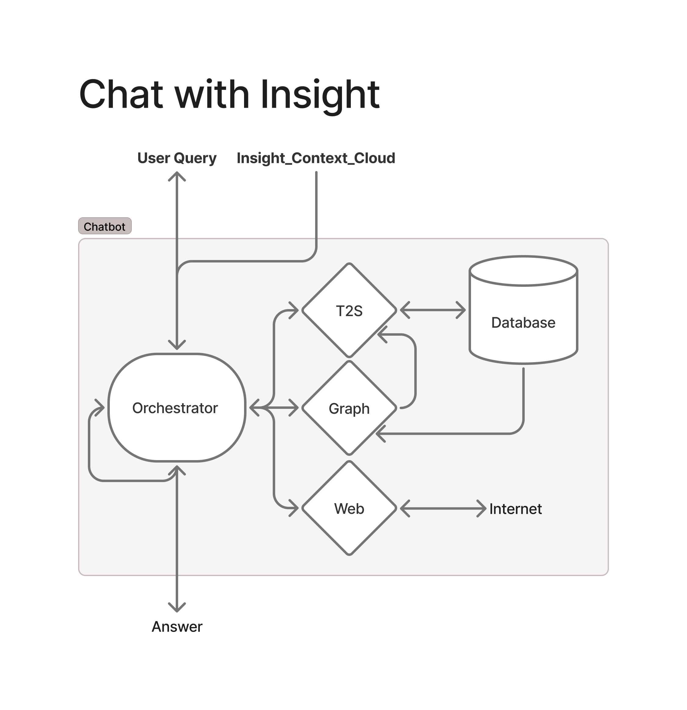
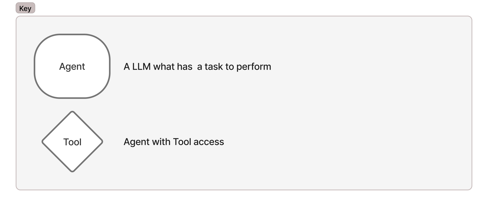

# 💬 Chat with Data

An intelligent data analysis platform that lets you interact with your datasets using natural language. Generate insights, visualize data, and get SQL queries through conversational AI.

## 🚀 Features

- **Natural Language to SQL** - Convert plain English questions into SQL queries
- **Automated Insight Generation** - Discover hidden patterns in your data
- **Interactive Visualizations** - Create charts with natural language commands
- **Conversational Interface** - Chat-based interaction with your datasets
- **Data Persistence** - SQLite backend for efficient data storage
- **AI-Powered Analysis** - GPT-4 powered insights and recommendations

## 🎯 Architecture





## 📦 Project Structure

```bash
chat-with-data/
├── agent_prompt/        # AI agent system prompts
├── data/                # Sample datasets
├── src/                 # Core application logic
│   ├── agent.py         # Main agent classes
│   ├── agent_states.py  # State definitions
│   └── utils.py         # Helper functions
├── app.py               # Streamlit UI
├── requirements.txt     # Dependencies
└── README.md
```

## 🛠️ Installation

Clone the repository:

```bash
git clone https://github.com/yourusername/chat-with-data.git
cd chat-with-data
```

Install dependencies:

```bash
pip install -r requirements.txt
```

Set up environment variables:

```bash
cp example.env .env
# Add your OpenAI API key to .env
```

## 🖥️ Usage

Start the application:

```bash
streamlit run app.py
```

1. Upload a CSV file through the web interface
2. Let the system generate initial insights
3. Ask questions in natural language:

   - "Show me sales trends by region"
   - "What's the correlation between price and demand?"
   - "Create a bar chart of monthly revenue"

## 🤖 Agents Architecture Features

### Core Components

#### Text2SQL Agent

- Converts natural language queries to executable SQL
- Automatic error recovery
- Multi-query generation
- SQL syntax validation

#### Insight Generator

- Automatically discovers data patterns:
  - Relationship mapping
  - Statistical analysis
  - Predictive insights

#### Graph Visualization

- Creates visualizations from natural language:
  - Matplotlib integration
  - Base64 image encoding
  - Interactive chart tuning

#### Chat Orchestrator

- Coordinates all components:
  - Manages conversation flow
  - Integrates web search
  - Handles visualization requests

## 🌟 Contributing

Contributions are welcome! Please follow these steps:

1. Fork the project
2. Create your feature branch (`git checkout -b feature/AmazingFeature`)
3. Commit your changes (`git commit -m 'Add some AmazingFeature'`)
4. Push to the branch (`git push origin feature/AmazingFeature`)
5. Open a Pull Request

## 📚 License

Distributed under the MIT License. See `LICENSE` for more information.

## 🙏 Acknowledgments

- OpenAI for GPT-4 integration
- Streamlit for UI framework
- LangChain for AI orchestration
- SQLite for lightweight database support
